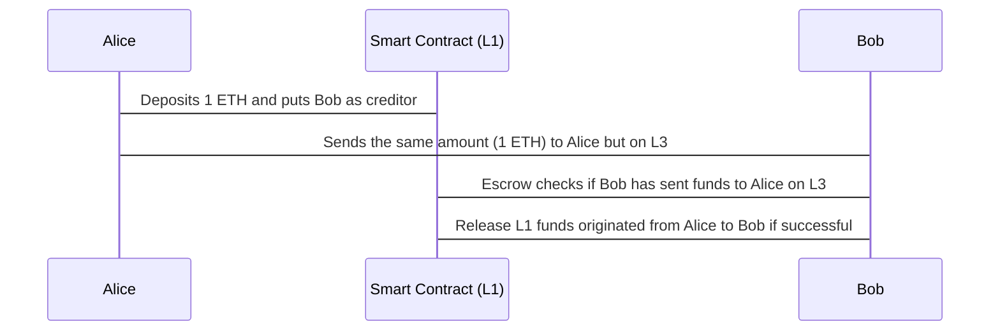

## Crosschain Escrow for L3 <> L1 validity rollups

Please find the Layer 3 repository [here](https://github.com/wsdt/zkevm-node).

**How does the L3 <> L1 crosschain escrow work?**


Native zkRollups utilizing a L3-Architecture based on Polygon's zkEVM to solve the interoperability between networks through a common state on L2. Exemplary app: Multichain Escrow between L1 and L3.

Our project was inspired by this blog article:
https://ethresear.ch/t/native-rollup-a-new-paradigm-of-zk-rollup/14529

As Polygon's zkEVM Beta got live this week, we thought it would be cool to get their zkEVM running locally and putting it on top of the L2 zkEVM, to have a super simplistic L3 architecture.

The trend seems to go towards a multi-layer architecture in future, such as L3's potentially for cross-chain compatibility, or L4's for privacy. Although, L3's might solve the interoperability issue between L3's and above, we might still have interoperability issues between lower layers.

Thankfully, really smart people developed somewhat resilient bridges, LayerZero, Cosmos, Polkadot & others that get better every day. Nonetheless, going from L3 to L1, might require multiple steps.

So we thought having a simple use case such as an Multichain Escrow between L1 and L3 could be a very interesting thought-model to exchange assets between networks that are not directly connected to each other such as L1's and L2's.

Considering the nature of Validity rollups and it's finality characteristics in contrast to optimistic rollups, it should not make that much of a difference if someone uses validity proofs between L1 & L2, or L1 and L3 as long as the single layers are Validity rollups.

----
Original documentation: 

# Bonsai Starter Template

Starter template for writing an application using [Bonsai].

This repository implements an application on Ethereum utilizing Bonsai as a coprocessor to the smart contract application.
It provides a starting point for building powerful new applications on Ethereum that offload computationally intensive, or difficult to implement tasks to a [RISC Zero] guest, with verified results sent to your Ethereum contract.

## Getting Started

Start building your application by forking this template.

### Dependencies

* Rust and Cargo: https://rustup.rs
* Ganache: https://www.npmjs.com/package/ganache#command-line-use

### Write Your App

Get started writing your application by modifying these key files:
* Replace `contracts/contracts/HelloBonsai.sol` with your on-chain application logic.
* Replace `methods/guest/src/bin/fibonacci.rs` with your Bonsai coprocessor logic.

Associated build configuration files and tests are discussed along with the [project structure](#project-structure) below.

### Build

Running the following will build the project, including Ethereum contracts and RISC Zero guest program.

```bash
cargo build
```

### Test

Running the following will run all tests, including Ethereum contracts and RISC Zero guest program.

```bash
cargo test
```

## Project Structure

```text
.
├── Cargo.toml
├── README.md
├── cli
│   ├── Cargo.toml
│   └── src
│       └── bin
│           ├── deploy.rs
│           └── poke.rs
├── contracts
│   ├── Cargo.toml
│   ├── build.rs
│   ├── contracts
│   │   ├── HelloBonsai.sol
│   │   ├── IBonsaiProxy.sol
│   │   ├── IBonsaiApp.sol
│   │   └── test
│   │       └── MockBonsaiProxy.sol
│   ├── src
│   │   └── lib.rs
│   └── tests
│       └── contract_tests/
│           ├── main.rs
│           └── utils.rs
└── methods
    ├── Cargo.toml
    ├── build.rs
    ├── guest
    │   ├── Cargo.toml
    │   └── src
    │       └── bin
    │           └── fibonacci.rs
    └── src
        └── lib.rs
```

### Contracts

Ethereum contracts are in the `contracts` directory.
Solidity can be found in `contracts/contracts` including the application source and an interface and mock implementation of the Bonsai proxy.
Rust functions to interact with your application are included in `contracts/src/lib.rs`.

Contracts are built and tested with [Cargo] with the Rust [ethers] libraries.
The build configuration is in `contracts/build.rs`.
Tests are written in Rust and run against Ganache.
Tests are defined in `contracts/tests`.

### Methods

[RISC Zero] guest programs are defined in the `methods` directory.
This is where you will define one or more guest programs to act as a coprocessor to your on-chain logic.
More example of what you can do in the guest can be found in the [RISC Zero examples].

Code in the `methods/guest` directory will be compiled into one or more [RISC-V] binaries.
Each will have a corresponding image ID, which is a hash identifying the program.
When deploying your application, you will upload your binary to Bonsai where the guest will run when requested.
The image ID will be included in the deployment of the smart contracts to reference your guest program living in Bonsai.

Build configuration for the methods is included in `methods/build.rs` and tests of the guest itself are in `methods/src/lib.rs`.

### CLI

A starter CLI is provided to help deploy contracts to Ethereum and RISC Zero guest programs to Bonsai.
Additionally the CLI includes example commands to interact with the smart contract via ethers.

CLI commands are defined in their respective files in `cli/src/bin`.

**To get access to Bonsai, sign up for the [waitlist].** 

#### Deploy

The `deploy` command shows how to deploy your application to Bonsai and to an Ethereum chain.

```text
cargo --bin deploy -- --help
Usage: deploy --ethereum-node-url <ETHEREUM_NODE_URL> --bonsai-url <BONSAI_URL> --bonsai-proxy-contract-address <BONSAI_PROXY_CONTRACT_ADDRESS> --bonsai-api-key <BONSAI_API_KEY> --ethereum-private-key <ETHEREUM_PRIVATE_KEY>

Options:
  -e, --ethereum-node-url <ETHEREUM_NODE_URL>
          JSON RPC URL for an Ethereum node that will serve call and transaction requests. Currently only HTTP(S) URLs are supported. 
  -b, --bonsai-url <BONSAI_URL>
          URL for the Bonsai service for to upload the ELF binary 
  -p, --bonsai-proxy-contract-address <BONSAI_PROXY_CONTRACT_ADDRESS>
          Ethereum contract address for the Bonsai proxy 
      --bonsai-api-key <BONSAI_API_KEY>
          API Key for Bonsai to authorize requests 
      --ethereum-private-key <ETHEREUM_PRIVATE_KEY>
          Ethereum private key to use for sending transactions 
```

#### Poke

The `poke` command shows a basic interaction with the application contract.
Making a request an waiting for a callback from Bonsai.

```text
cargo --bin poke -- --help
Usage: poke --ethereum-node-url <ETHEREUM_NODE_URL> --hello-bonsai-contract-address <HELLO_BONSAI_CONTRACT_ADDRESS> --ethereum-private-key <ETHEREUM_PRIVATE_KEY> <N>

Arguments:
  <N>  Value of n to use as the input to the Fibonacci calculation

Options:
  -e, --ethereum-node-url <ETHEREUM_NODE_URL>
          JSON RPC URL for an Ethereum node that will serve call and transaction requests. Currently only HTTP(S) URLs are supported
  -a, --hello-bonsai-contract-address <HELLO_BONSAI_CONTRACT_ADDRESS>
          HelloBonsai contract address
      --ethereum-private-key <ETHEREUM_PRIVATE_KEY>
          Ethereum private key to use for sending transactions
```

[Bonsai]: https://dev.bonsai.xyz/
[RISC Zero]: https://www.risczero.com/
[ethers]: https://docs.rs/ethers/latest/ethers/
[Cargo]: https://doc.rust-lang.org/cargo/
[RISC Zero examples]: https://github.com/risc0/risc0/tree/main/examples
[RISC-V]: https://www.risczero.com/docs/reference-docs/about-risc-v
[waitlist]: https://fmree464va4.typeform.com/to/t6hZD54Z
